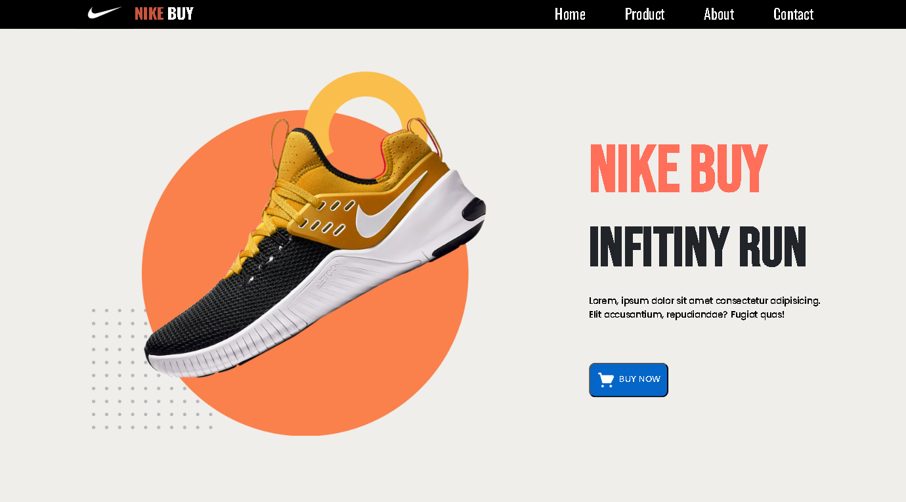

# Store Nike Buy 👟

Loja virtual fictícia inspirada no design da Nike, criada com foco em front-end responsivo.  
Projeto desenvolvido para praticar HTML, CSS e JavaScript puro, com foco em layout, responsividade e experiência do usuário.

## 🖼️ Preview do Projeto



## 🚀 Tecnologias usadas

- HTML5
- CSS3
- JavaScript

## 📱 Funcionalidades

- Menu responsivo com ícone hamburguer
- Seções de produtos casuais e formais
- Página "Sobre" com ícones e descrição da loja
- Botões "Buy Now" simulando ação de compra

---

## 🧠 O que aprendi nesse projeto

- Estruturação de páginas com HTML semântico  
- Estilização avançada com CSS usando Flexbox e Grid  
- Manipulação de DOM e eventos com JavaScript  
- Organização do projeto para produção real  
- Publicação do projeto com Ver

---

## 🌐 Acesse o projeto
👉 [Clique aqui para ver o projeto online](https://store-nike-buy.vercel.app/)

---

## 🖥️ Como rodar localmente

```bash
# Clone o repositório
git clone https://github.com/CarolineSantoss/Store-Nike-Buy.git

# Entre na pasta do projeto
cd Store-Nike-Buy

# Abra o arquivo index.html no seu navegador (clicando duas vezes ou usando Live Server no VSCode)

---

💻 Projeto desenvolvido com fins educacionais  
👩‍💻 Por: **Caroline Santos**
